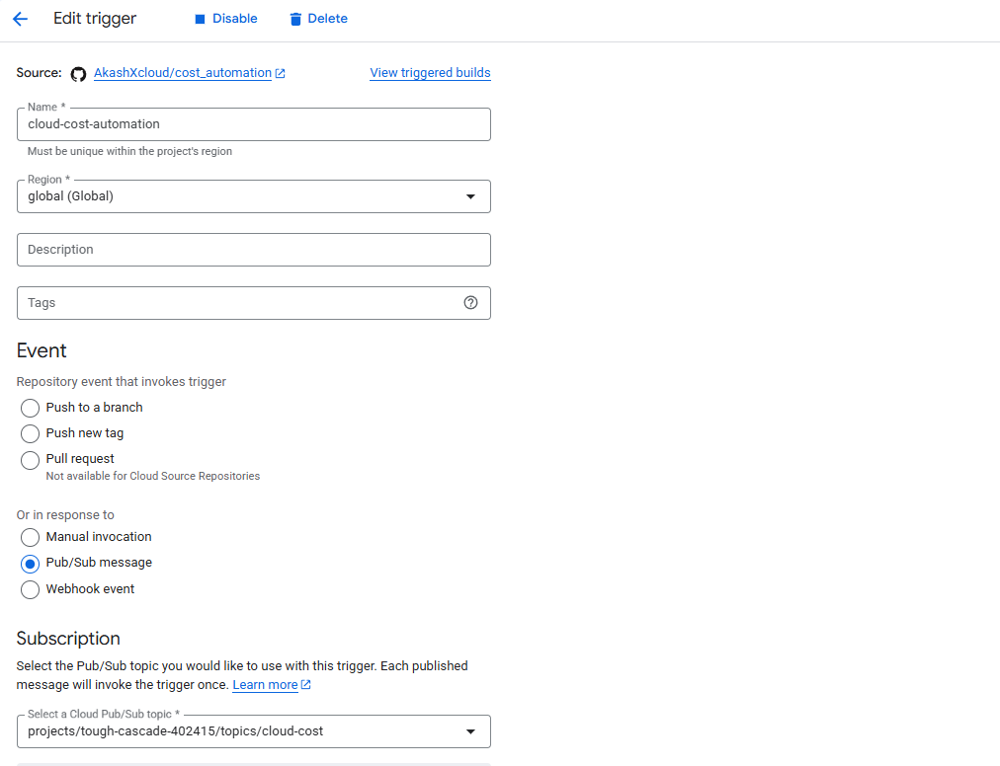
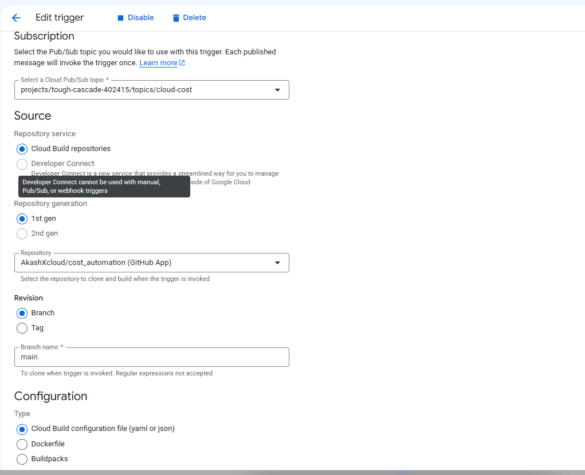
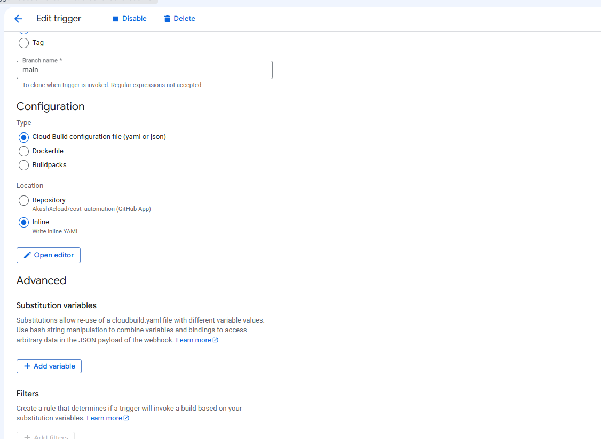
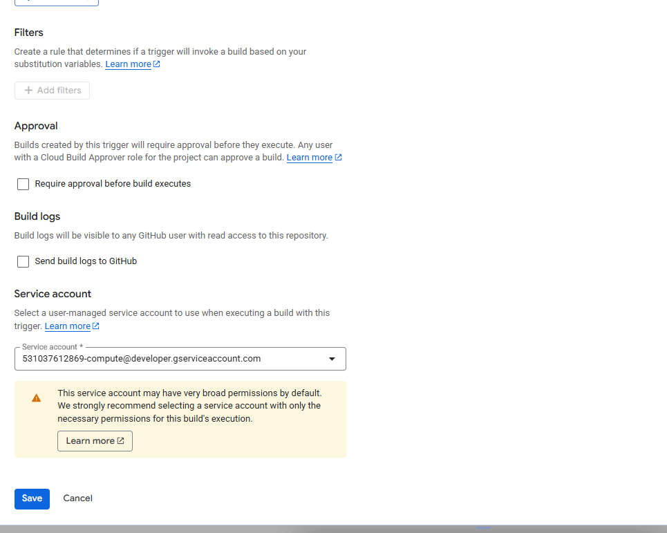

# Multi-Cloud Cost & Inventory Dashboard

Pulls **running instance inventory** and **spend data** from AWS, Azure, and
GCP using each provider's own SDK/credentials, then renders a single static
HTML dashboard you can open in a browser.

This runs entirely on your machine (or the build VM) — nothing is sent
anywhere except to the cloud providers' own APIs using your existing
credentials.

## 1. Install dependencies

```bash
pip install -r requirements.txt --break-system-packages
```

## 2. Credentials — use what you already have configured

**AWS** — uses your existing `aws configure` / `~/.aws/credentials` /
instance role. Needs these IAM permissions at minimum:
- `ec2:DescribeInstances`, `ec2:DescribeRegions`
- `ce:GetCostAndUsage` (Cost Explorer — must be enabled once in the
  Billing console; it's off by default on new accounts)

**Azure** — uses `az login` session or a service principal
(`AZURE_CLIENT_ID`, `AZURE_TENANT_ID`, `AZURE_CLIENT_SECRET` env vars).
Needs `Reader` role on the subscription(s) plus `Cost Management Reader`.

**GCP** — uses `gcloud auth application-default login` or a service
account key (`GOOGLE_APPLICATION_CREDENTIALS` env var pointing at the JSON
key). Needs `roles/compute.viewer`. For actual spend (not just list
pricing) GCP requires **BigQuery billing export** to be enabled once per
billing account — see `collectors/collect_gcp.py` header comment for the
one-time setup. Without it, the dashboard still shows instance inventory,
just no GCP cost panel.

## 3. Set which accounts/directories/projects to scan

Edit `config.json` (created on first run from `config.example.json`). Each
provider takes a **list**, so you can point it at as many accounts as you
have credentials for, and the dashboard will show a combined total plus a
per-account breakdown:

```json
{
  "aws": {
    "enabled": true,
    "accounts": [
      { "name": "prod", "profile": "prod" },
      { "name": "dev", "profile": "dev" }
    ]
  },
  "azure": {
    "enabled": true,
    "directories": [
      {
        "name": "main-tenant",
        "tenant_id": "",
        "client_id": "",
        "client_secret": "",
        "subscription_ids": []
      }
    ]
  },
  "gcp": {
    "enabled": true,
    "projects": [
      { "name": "prod-project", "project_id": "my-prod-project",
        "credentials_file": "", "billing_bq_table": "" }
    ]
  }
}
```

Notes per provider:

- **AWS `accounts[].profile`** — the profile name as it appears in
  `~/.aws/credentials` (`aws configure --profile prod`). Leave `profile`
  blank/omit it to use your default credentials for that entry.
- **Azure `directories[].tenant_id/client_id/client_secret`** — fill all
  three to scan a tenant via a service principal. Leave them blank to
  fall back to your current `az login` session (fine for a single
  tenant). Leave `subscription_ids` empty to auto-discover every
  subscription reachable in that tenant, or list specific ones.
- **GCP `projects[].credentials_file`** — path to a service account JSON
  key for that project. Leave blank to use
  `gcloud auth application-default login` / `GOOGLE_APPLICATION_CREDENTIALS`.
  Each project needs its own `billing_bq_table` (see below) to show cost.

Leave a provider's top-level `enabled` as `false` if you don't want to
scan it at all.

## 4. Run it

```bash
python run_all.py
```

This will:
1. Call each enabled collector, writing `data/aws.json`, `data/azure.json`,
   `data/gcp.json`.
2. Build `dashboard.html` from that combined data.

Open `dashboard.html` in a browser. Re-run `python run_all.py` any time to
refresh — there's no background server, it's a fresh static snapshot each
run.

## Files

| File | Purpose |
|---|---|
| `collectors/collect_aws.py` | EC2 instance inventory (all regions) + Cost Explorer spend by service |
| `collectors/collect_azure.py` | VM inventory (all subscriptions) + Cost Management spend by service |
| `collectors/collect_gcp.py` | Compute Engine instance inventory (all zones) + optional BigQuery billing export spend |
| `generate_dashboard.py` | Merges the three JSON files and renders `dashboard.html` |
| `run_all.py` | Orchestrates the above end to end |

## Dashboard layout

The header always shows the **combined total spend across all clouds**
plus the proportional split (that's the "overall cost" view). Below it
are three tabs:

- **Cost** — three parts, top to bottom:
  1. **Overview strip** — the overall combined total across all clouds,
     plus each cloud's total for the collection period, as quick stat
     cards.
  2. **Daily spend table** — one row per calendar day, one column per
     cloud, plus a row total, most recent day first. Needs the daily
     cost collector to have run (it does automatically alongside the
     per-service breakdown — see `collect_cost_by_day` in each
     collector).
  3. **Suggestions to reduce cost** — a small rules engine that looks at
     what's actually running and flags:
     - dev/test/staging-looking instances (matched on account or
       instance name) that have been running continuously for 3+ days
     - stopped instances that still have a nonzero per-resource cost
       (usually leftover attached storage/IPs)
     - a cloud where one service accounts for >50% of spend, suggesting
       Reserved Instances / Savings Plans / Committed Use Discounts
     - any instance running 30+ days straight, flagged for a manual
       utilization check (this dashboard has no CPU/memory metrics, so
       it can't tell you if it's oversized — only that it's long-lived)
     - a note when per-resource cost coverage is low, since that limits
       how specific these suggestions can get
     None of this replaces AWS Compute Optimizer / Azure Advisor / GCP
     Recommender — it's a first-pass filter over data this dashboard
     already has, without needing those APIs enabled.
  Below all of that are the existing per-cloud spend-by-service panels
  and account breakdowns.
- **Infrastructure** — now a vertically stacked layout (one cloud per
  full-width panel, easier to read many columns) rather than side-by-side
  cards. Each panel has a filter bar (free-text search across name,
  owner, account, IPs; plus a state dropdown) above its instance table.
  Columns: name, **owner**, account, type, location, **internal IP**,
  **external IP**, state, since, duration, and a **start/stop action**
  button.

  **Important about the start/stop button**: it does **not** call any
  cloud API directly. This dashboard is a static HTML file with no
  backend and no live credentials in the browser — wiring real start/stop
  calls into client-side JS would mean embedding cloud credentials into a
  public file, letting anyone who views the page source control your
  real infrastructure. Instead, clicking the button **copies the exact
  CLI command** (`aws ec2 stop-instances ...`, `az vm deallocate ...`,
  `gcloud compute instances stop ...`) to your clipboard, which you then
  run yourself with your own authenticated CLI session. Same convenience,
  no credential exposure.

  IP address availability per provider:
  - **AWS**: both public and private IP come directly from
    `describe_instances` — no extra calls needed.
  - **Azure**: VMs don't carry IPs directly; the collector makes 1-2
    extra API calls per VM (via `NetworkManagementClient`) to fetch the
    primary NIC's private IP and, if attached, its public IP. This adds
    some latency for accounts with many VMs.
  - **GCP**: both come directly from the instance's `network_interfaces`
    — no extra calls needed.

  "Owner" is pulled from each instance's own tags/labels, not a separate
  system — set it however you already tag resources (`Owner` tag on
  AWS/Azure, `owner` label on GCP). Instances without that tag just show
  `—`.

  "Since" is when the instance entered its *current* state (running or
  stopped); "Duration" is computed live in your browser as time-elapsed
  from that point, so it keeps ticking forward correctly no matter when
  you open the dashboard.
- **Resource Cost** — a single combined table across all clouds listing
  every instance with its individual cost, where available, sorted
  highest-spend first. A coverage note at the top tells you what % of
  resources actually have per-resource cost data, since that requires
  extra setup per provider (see below).

## Per-resource cost (used by the Resource Cost tab)

Out of the box, cost is broken down **per service** (e.g. "EC2", "VM",
"Compute Engine"). The collectors also make a best-effort attempt at
**per-instance** cost, but each provider needs something enabled first:

- **AWS**: requires "hourly and resource-level data" turned on in Cost
  Explorer preferences (Billing console — this is a paid add-on feature).
  Without it, `collect_cost_by_resource` in `collect_aws.py` will fail
  silently and that provider's instances just show no per-resource cost.
- **Azure**: works out of the box via Cost Management grouped by
  `ResourceId` — no extra setup needed, as long as the credential has
  Cost Management Reader.
- **GCP**: requires the BigQuery billing export (see `collect_gcp.py`
  header) — once enabled, per-resource cost is matched by instance name
  from the same export used for the per-service breakdown.

If per-resource cost isn't available for a given instance, the Resource
Cost tab just shows `—` for that row rather than omitting the instance.


Steps:

1) Storage the Dashborad.html page in storage in GCP.
2) create a cloud build.
3) create a secret in secret manager
   Ex: AWS access and secret keys and Azure(subscription, app registration)
4) In Azure create a app registration, grant the permission to it and create secret a in app registration then copy (value, tenant id and client id) and create a secret in GCP
5) Take the AWS access and secret key and create a secret in GCP

Cloud BUild:







6) grant the permission to the service account (like: secret manager)

7) line yaml:
steps:
  - name: python:3.12-slim
    args:
      - '-c'
      - |
        ls
        pip install -r requirements.txt --break-system-packages
        python run_all.py
    entrypoint: bash
    secretEnv:
      - AWS_ACCESS_KEY_ID
      - AWS_SECRET_ACCESS_KEY
      - AZURE_CLIENT_SECRET
      - AZURE_TENANT_ID
      - AZURE_CLIENT_ID
      - AZURE_TENANT_ID_2
      - AZURE_CLIENT_ID_2
      - AZURE_CLIENT_SECRET_2
  - name: gcr.io/cloud-builders/gsutil
    args:
      - cp
      - dashboard.html
      - gs://balaji-testing/cloud_cost_automation/dashboard.html
options:
  logging: CLOUD_LOGGING_ONLY
availableSecrets:
  secretManager:
    - versionName: projects/$PROJECT_ID/secrets/aws-access-key-id/versions/latest
      env: AWS_ACCESS_KEY_ID
    - versionName: projects/$PROJECT_ID/secrets/aws-secret-access-key/versions/latest
      env: AWS_SECRET_ACCESS_KEY
    - versionName: projects/$PROJECT_ID/secrets/azure-tenant-id/versions/latest
      env: AZURE_TENANT_ID
    - versionName: projects/$PROJECT_ID/secrets/azure-client-id/versions/latest
      env: AZURE_CLIENT_ID
    - versionName: projects/531037612869/secrets/azure-client-secret/versions/1
      env: AZURE_CLIENT_SECRET
    - versionName: projects/$PROJECT_ID/secrets/azure-tenant-id-2/versions/latest
      env: AZURE_TENANT_ID_2
    - versionName: projects/$PROJECT_ID/secrets/azure-client-id-2/versions/latest
      env: AZURE_CLIENT_ID_2
    - versionName: projects/$PROJECT_ID/secrets/azure-client-secret-2/versions/latest
      env: AZURE_CLIENT_SECRET_2


